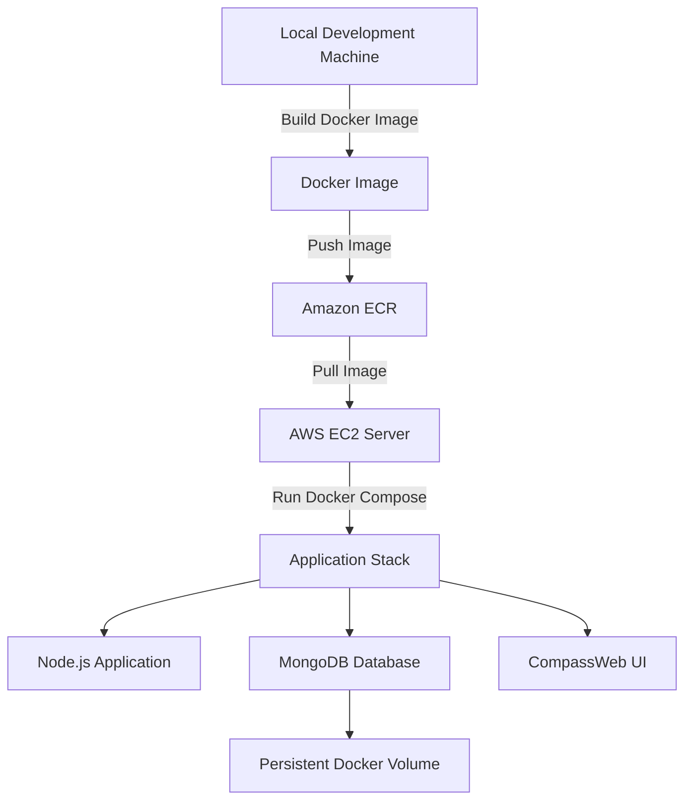

# Profile App — Manual DevOps Deployment Project

This project is a hands-on DevOps deployment project built to practice real cloud and container workflows.

Instead of focusing on building a complex application, I focused on understanding how applications move from local development to a live cloud server using Docker and AWS infrastructure.

The project uses a Node.js application connected to MongoDB, containerized with Docker, stored in Amazon ECR, and deployed on an AWS EC2 instance using Docker Compose.

---

# Technologies Used

| Area        | Technologies           |
| ----------- | ---------------------- |
| Backend     | Node.js, Express       |
| Database    | MongoDB                |
| Containers  | Docker, Docker Compose |
| Cloud       | AWS EC2, Amazon ECR    |
| Tools       | Linux, Git             |
| Database UI | CompassWeb             |

---

# Why I Built This Project

I built this project to better understand:

* Docker containerization
* Multi-container deployments
* Cloud deployment workflows
* Docker image registries
* Linux server management
* AWS infrastructure basics

Before learning CI/CD tools like Jenkins or GitHub Actions, I wanted to first understand the manual deployment process behind the scenes.

---

# What the Application Does

The application is a simple profile dashboard.

It allows users to:

* View profile information
* Update profile information
* Store data inside MongoDB
* Access the application through a clean web interface

---

# Architecture Diagram




# Project Structure

```text id="2k57ca"
profile-devops-project/
│
├── application/
│   ├── index.html
│   ├── server.js
│   ├── package.json
│   ├── images/
│
├── Dockerfile
├── docker-compose.example.yml
├── .dockerignore
├── .gitignore
└── README.md
```

---

# Docker Services

| Service    | Purpose                      |
| ---------- | ---------------------------- |
| my-app     | Runs the Node.js application |
| mongodb    | Stores application data      |
| CompassWeb | MongoDB web interface        |
| mongo-data | Persistent database storage  |

---

# What I Learned

This project helped me practice:

* Linux server administration
* Docker containerization
* Docker Compose orchestration
* Amazon ECR workflows
* AWS EC2 deployment
* MongoDB persistence
* Container networking
* Environment variable configuration

Most importantly, it helped me understand how real deployments work before introducing automation tools.

---

# Future Improvements

Next, I plan to expand this project with:

* Jenkins CI/CD
* GitHub Actions

