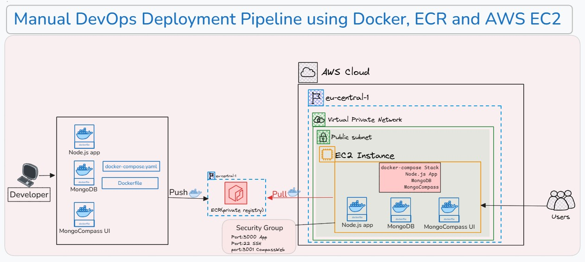
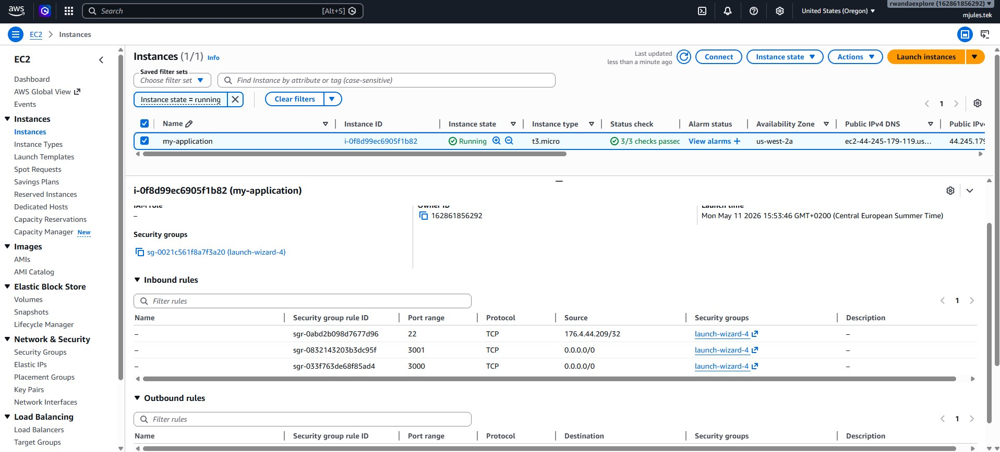
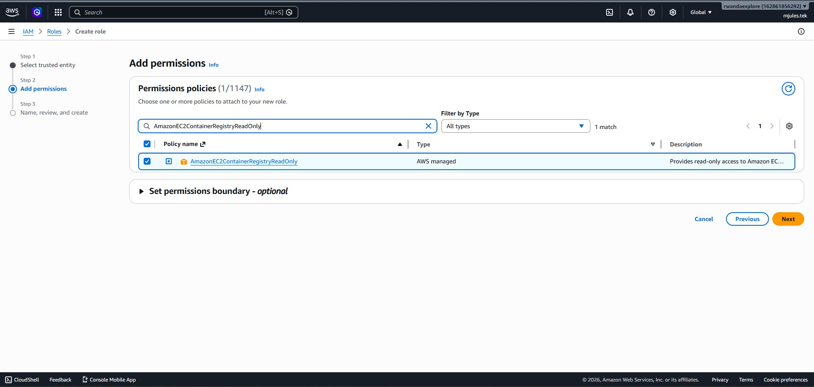
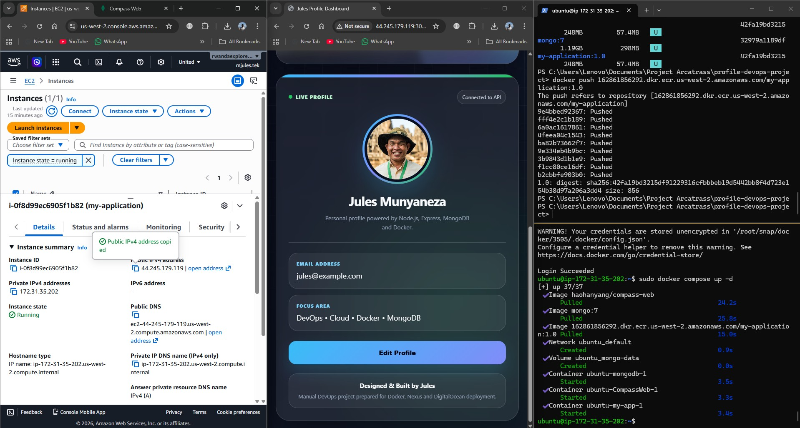

# 🚀 Profile App — Manual DevOps Deployment Project

A hands-on DevOps deployment project built to practice real-world containerization, cloud deployment, and Linux server workflows.

Instead of focusing on building a complex application, this project focuses on understanding how applications move from local development to a live production-like environment using Docker and AWS infrastructure.

The application is built with Node.js and MongoDB, containerized with Docker, stored in Amazon ECR, and deployed on an AWS EC2 instance using Docker Compose.

---
## 🌟 Portfolio Case Study Summary

This project represents my first hands-on manual DevOps deployment case study.

At this stage, I focused on understanding the full deployment process before introducing CI/CD automation. I worked through the practical steps of containerizing a Node.js application, running MongoDB as a separate service, managing containers with Docker Compose, pushing Docker images to Amazon ECR, and deploying the application on an AWS EC2 Linux server.

The goal was to understand what happens behind the scenes when an application moves from local development to a live cloud environment.

### What This Stage Showcases

* Built a simple Node.js profile dashboard application
* Connected the application to MongoDB
* Created a Docker image for the application
* Used Docker Compose to run multiple services together
* Added MongoDB persistence with Docker volumes
* Created and configured an Amazon ECR repository
* Tagged and pushed Docker images to Amazon ECR
* Connected to an AWS EC2 instance using SSH
* Pulled and ran the application image on the server
* Configured AWS Security Groups for application access
* Practiced IAM permissions for ECR access
* Managed deployment manually through Linux commands

### DevOps Value of This Project

This project helped me understand the foundation of real-world DevOps deployment workflows.

Before using automation tools like GitHub Actions, Jenkins, Kubernetes, or Terraform, I wanted to manually practice the core deployment process. This gave me a better understanding of Docker images, registries, Linux servers, networking, persistence, and cloud infrastructure.

This project is the foundation for my next DevOps stages, where I will improve the same workflow with CI/CD, reverse proxy configuration, HTTPS, infrastructure as code, monitoring, and production-grade deployment practices.


# 🏗️ Architecture Diagram



---

# 📌 Project Overview

This project demonstrates a complete manual DevOps deployment workflow:

- Building Docker images locally
- Managing multi-container applications
- Pushing Docker images to Amazon ECR
- Deploying containers on AWS EC2
- Using Docker Compose for orchestration
- Managing MongoDB persistence with Docker volumes
- Configuring AWS Security Groups and IAM roles

---

# ⚙️ Technologies Used

| Category | Technologies |
|---|---|
| Backend | Node.js, Express |
| Database | MongoDB |
| Containerization | Docker, Docker Compose |
| Cloud Platform | AWS EC2, Amazon ECR |
| DevOps Tools | Linux, Git |
| Database UI | CompassWeb |

---

# 🎯 Why I Built This Project

I built this project to strengthen my understanding of:

- Docker containerization
- Multi-container deployments
- AWS cloud deployment workflows
- Linux server administration
- Docker networking
- Docker image registries
- Infrastructure fundamentals

Before learning CI/CD automation tools like Jenkins or GitHub Actions, I wanted to first understand how deployments work manually behind the scenes.

---

# 🖥️ Application Features

The application is a simple profile dashboard that allows users to:

- View profile information
- Update profile data
- Store information inside MongoDB
- Access the application through a clean responsive UI

---

# 🌐 Application Routes

```text
GET  /
GET  /profile-picture
GET  /get-profile
POST /update-profile
```

---

# 📂 Project Structure

```text
profile-devops-project/
│
├── application/
│   ├── index.html
│   ├── server.js
│   ├── package.json
│   ├── package-lock.json
│   └── images/
│
├── screenshots/
│   ├── architecture-diagram.png
│   ├── ec2-security-group.png
│   ├── iam-ecr-role.jpg
│   └── running-application.png
│
├── Dockerfile
├── docker-compose.example.yml
├── .dockerignore
├── .gitignore
└── README.md
```

---

# 🐳 Docker Services

| Service | Purpose |
|---|---|
| my-app | Runs the Node.js application |
| mongodb | Stores application data |
| CompassWeb | MongoDB web interface |
| mongo-data | Persistent Docker volume for MongoDB |

---

# 🔄 Deployment Workflow

## 1. Build Docker Image

```bash
docker build -t my-application:1.0 .
```

---

## 2. Tag Docker Image

```bash
docker tag my-application:1.0 <AWS_ACCOUNT_ID>.dkr.ecr.<AWS_REGION>.amazonaws.com/my-application:1.0
```

---

## 3. Push Docker Image to Amazon ECR

```bash
docker push <AWS_ACCOUNT_ID>.dkr.ecr.<AWS_REGION>.amazonaws.com/my-application:1.0
```

---

## 4. Connect to AWS EC2

```bash
ssh -i my-key.pem ubuntu@<EC2_PUBLIC_IP>
```

---

## 5. Authenticate Docker with Amazon ECR

```bash
aws ecr get-login-password --region <AWS_REGION> | sudo docker login --username AWS --password-stdin <AWS_ACCOUNT_ID>.dkr.ecr.<AWS_REGION>.amazonaws.com
```

---

## 6. Deploy Containers with Docker Compose

```bash
sudo docker compose up -d
```

---

# 📸 Project Screenshots

## AWS EC2 Security Group Configuration



---

## IAM Role Configuration for Amazon ECR Access



---

## Running Application & Docker Containers



---

# 📚 What I Learned

This project helped me practice and understand:

- Linux server management
- Docker image creation
- Docker Compose orchestration
- Amazon ECR workflows
- AWS EC2 deployment
- MongoDB persistence
- Container networking
- Environment variable management
- Manual DevOps deployment processes

Most importantly, this project helped me understand how real deployments work before introducing CI/CD automation.

---

# 🚀 Future Improvements

Next, I plan to expand this project with:

- Jenkins CI/CD Pipelines
- GitHub Actions Automation
- Nginx Reverse Proxy
- HTTPS & SSL Configuration
- Kubernetes Deployment
- Terraform Infrastructure as Code
- Monitoring & Logging

---

# 👨‍💻 Author

### Jules Munyaneza

Manual DevOps Deployment Portfolio Project  
Built for learning, practice, and DevOps engineering growth.
